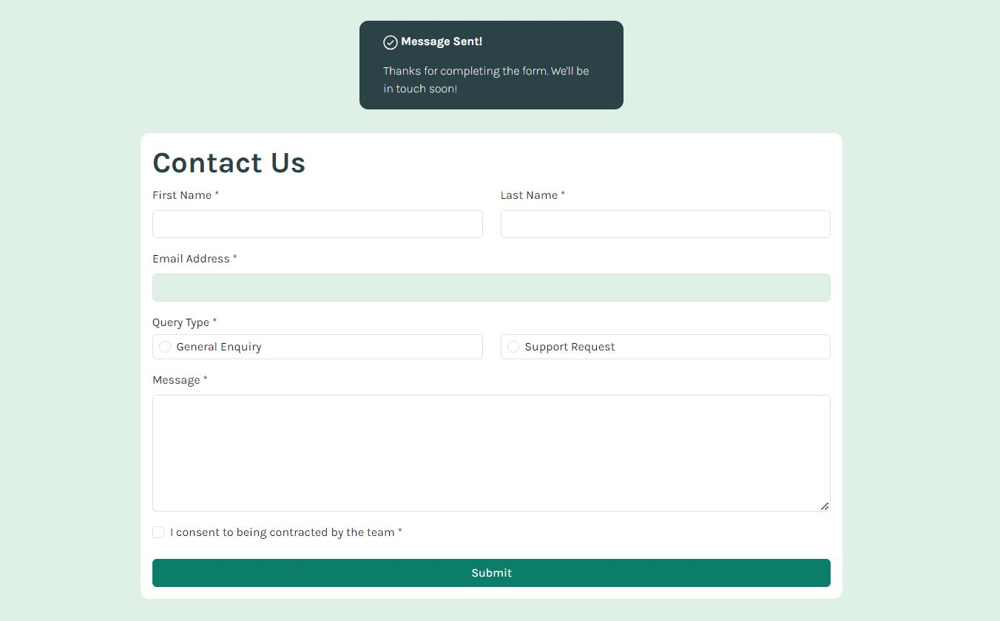

# Frontend Mentor - Contact form solution

This is a solution to the [Contact form challenge on Frontend Mentor](https://www.frontendmentor.io/challenges/contact-form--G-hYlqKJj). Frontend Mentor challenges help you improve your coding skills by building realistic projects. 

## Table of contents

- [Overview](#overview)
  - [The challenge](#the-challenge)
  - [Screenshot](#screenshot)
  - [Links](#links)
- [My process](#my-process)
  - [Built with](#built-with)
  - [What I learned](#what-i-learned)
  - [Continued development](#continued-development)
  - [Useful resources](#useful-resources)
- [Author](#author)
- [Acknowledgments](#acknowledgments)

**Note: Delete this note and update the table of contents based on what sections you keep.**

## Overview

### The challenge

Users should be able to:

- Complete the form and see a success toast message upon successful submission
- Receive form validation messages if:
  - A required field has been missed
  - The email address is not formatted correctly
- Complete the form only using their keyboard
- Have inputs, error messages, and the success message announced on their screen reader
- View the optimal layout for the interface depending on their device's screen size
- See hover and focus states for all interactive elements on the page

### Screenshot




### Links

- Solution URL: [https://www.frontendmentor.io/profile/DiegoIBH/solutions](https://www.frontendmentor.io/profile/DiegoIBH/solutions)
- Live Site URL: [https://diegoibh.github.io/frontEndMentor-contactForm/](https://diegoibh.github.io/frontEndMentor-contactForm/)

## My process

### Built with

- Semantic HTML5 markup
- CSS custom properties(with Sass)
- Flexbox
- CSS Grid/Flex
- Mobile-first workflow (using Bootstrap selectors)
- [Jquery](https://jquery.com/) - JS library/framework
- [Bootstrap](https://getbootstrap.com/docs/5.3/getting-started/introduction/) - Front end toolkit

### What I learned

I was able to understand better the functionality behind the contact form. I normally use a plug-in for certain functionalitlies and knew only the basics of how they worked.

To see how you can add code snippets, see below:

```scss
//Setting theme colors as primary and secondary
$primary: $green-600; 
$secondary: $green-200;
//Using adapted theme coloros (in accordance with guidelines of project) and apply them in to bootstrap css variables
$form-check-input-checked-color-custom: $primary;
$form-check-radio-checked-bg-image:       url("data:image/svg+xml,<svg xmlns='http://www.w3.org/2000/svg' viewBox='-4 -4 8 8'><circle r='2' fill='#{$form-check-input-checked-color-custom}'/></svg>") !default;
$focus-ring-box-shadow: none;
//Import Bootstrap scss files after the changed variables so the changes are applied
@import "../node_modules/bootstrap/scss/bootstrap.scss";
```
```js
//I liked the error control method, to set it to false and add the variable set to true if the condition is met
var hasError = false;
if(emailValue == "" || emailValue == null || emailValue == undefined){
            $("#emailError").html("Please enter an email address");
            $("#exampleFormControlInput1").addClass("border-error");
            hasError = true;
        } else if(emailValue.indexOf("@") == -1 || emailValue.indexOf(".") == -1){
            $("#emailError").html("Please enter a valid email address that includes at least one '@' and one '.'");
            $("#exampleFormControlInput1").addClass("border-error");
            hasError = true;
        };
//then the condition that produces the success or fail error
 if(!hasError){/*Including the success card that appears on top of the form*/}else{/*add the error card that appears on top of the form*/}
```

### Continued development

I would like to understand more in depth JS functionalities in order to use better the plug-ins in libraries and have a better general coding understanding. 

### Useful resources

- [MDN docs](https://developer.mozilla.org/en-US/) - Check JS functionality of the project.


## Author

- Website - [Diego Barros](https://diegoibh-curr.wuaze.com/)
- Frontend Mentor - [@DiegoIBH](https://www.frontendmentor.io/profile/DiegoIBH)
- Github - [@DiegoIBH](https://github.com/DiegoIBH)